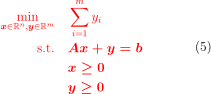

# A Demo of Primal Simplex Solver


## 1 Introduction

This project implements a Simplex solver basically follows from Dimitris Bertsimas's famous book *Introduction to Linear Optimization*. In order to solve a standard form LP problem, two phases are needed - the first phase checks if the problem is solvable and gives a feasible solution if so, the second phase checks if the problem is bounded and gives the optimal solution if so. Besides the final primal solution for the problem, this project can be set to provide step-by-step solutions as well as dual solutions.


## 2 Implementation

**If you just want to know how to use the script, you can SKIP this section and take a look at SECTION 3 instead.**


### 2.1 Pivoting

Pivoting is explain first since it is the core of the whole algorithm.

Given an entering variable with index $q$ and a leaving variable with index $p$, we pivot around $T_{pq}$, where $T$ is the simplex tableau. To be more specific, the algorithm updates coefficient matrix $\boldsymbol{A}$, the reduced cost $\boldsymbol{r}$ and the objective value $z$ with

<div align=center></div>

Then we update the base $\boldsymbol{B}$, meaning replace $p$ with $q$.


### 2.2 Selecting the entering and leaving variables

This section explains how does the algorithm choose the appropriate entering variable and leaving variable given coefficient matrix $\boldsymbol{A}$, the reduced cost $\boldsymbol{r}$ and the right hand side value $\boldsymbol{b}$.

To avoid degeneracy, the implementation follows the Bland's rule, i.e.

1. For the entering variable $q$, choose the lowest-numbered non-basic column with a negative reduced cost $\boldsymbol{r}$
2. For the leaving variable $p$, choose the row with the lowest ratio (i.e. "b/y ratio") between the right hand side $\boldsymbol{b}$ and the coefficient in the pivot tableau $\boldsymbol{A}$ where the coefficient is greater than zero. If the minimum ratio is shared by several rows, choose the row with the lowest-numbered column basic in it.


### 2.3 First Phase

Now we take a look at how is the first phase implemented.

Given a LP problem in standard form, i.e.

<div align=center></div>

First transform it to the corresponding auxiliary problem by adding manual variables

<div align=center></div>

Multiply $-1$ for lines that have corresponding $b<0$. Notice that $\boldsymbol{x=0, y=b}$ is a basic feasible solution for the auxiliary problem so we start solving $(5)$ with it.

The algorithm finds an entering variable $q$ from examining the reduced costs and finds a leaving variable $p$ from examining the corresponding "b/y ratio" as described in section 2.2. Then the algorithm invokes pivoting as described in section 2.1. Continue this procedure until the optimal solution for the auxiliary problem is obtained. Now, if the optimal objective value for the auxiliary problem is larger than 0, then the primal problem is infeasible; if the optimal objective value for the auxiliary problem is 0, then the primal problem has feasible solution.

Before returning the feasible solution obtained from auxiliary problem, the algorithm makes sure that the solution doesn't contain any manual variable. If there were manual variables inside the solution, keep pivoting to replace them with non-manual variables or remove redundant constraints.

Finally, give out the feasible solution of the primal problem as will as the respective base.


### 2.4 Second Phase

The first phase has generated a BFS for the primal problem and we can start solving $(4)$ with it.

The solving procedure in phase two is similar to the one described in section 2.3. However, this time, the algorithm cares about the boundness rather than feasibility. After selecting an entering variable $q$ according to section 2.2, the algorithm checks the corresponding coefficient column $\boldsymbol{A_q} = (A_{1q}, A_{2q}, \cdots, A_{mq})$. If $\boldsymbol{A_q} \leq \boldsymbol{0}$, then the problem is unbounded. Otherwise, select a leaving variable and pivot according to section 2.1. Keep pivoting until all reduced costs become non-negative, meaning the optimal solution is obtained.

Notice that the objective value during pivoting is the opposite number of the true objective, hence the algorithm negates the obtained objective value as output at last.


### 2.5 Dual Solution

The algorithm records the base at the start of the second phase and that base will be used to find the dual values. Notice that the dual values are the opposite numbers of corresponding reduced costs, so the algorithm can obtain those dual values easily.


## 3 How to Run the Code

### 3.1 Environment

The tested environment (with Anaconda under Windows 10) is listed below:

1. Python 3.8.3
2. NumPy 1.18.5
3. pandas 1.0.5


### 3.2 Commands

#### 3.2.1 Input Path

You **MUST** provide the script with the path to the folder that contains input files. **This script only accepts csv files for input, with names `A.csv`, `b.csv`, `c.csv` for the same meaning in equation $\textbf{(4)}$ listed in section 2.3.** Sample inputs are provided under the folder `data\`.

Suppose the following is your file structure **(Meaning that the script `simplex.py` and the folder that contains input files are under the same directory. Note this repo contains a few more subfolders in `data\`)**

```bash
.
├── data
│   ├── A.csv
│   ├── b.csv
│   └── c.csv
└── simplex.py
```

Then you should pass the path of folder `data\` to the script. For example,

```bash
python simplex.py data\
```

**Note: Your input must at least contain `A.csv`, `b.csv` and `c.csv`, missing any file will cause an exception, reminding you to check the path.** The solution file is not required.


#### 3.2.2 Step-by-step Solutions

The script is capable of providing step-by-step solutions. If you want to use that functionality, simply add `-s` or `-step` after the basic command shown in section 3.2.1. For example, with the previous file structure, you can type the following command

```bash
python simplex.py data\ -s
```

or

```bash
python simplex.py data\ --step
```

The printed Simplex tableau can be represented as the table shown below, where $\boldsymbol{A}$ is the matrix of coefficients, $\boldsymbol{b}$ is the vector of right hand values, $\boldsymbol{r}$ is the vector of reduced costs and $z$ is the opposite number of the true objective value.

```bash
┏━━━━━━━━━━━━━━━━━━━━━━━━━━━━━━━━━━━━━━━━━━━━━━━━━━━━━━━━━━━━━━━━━━━━━━━━━━━━━━━━━━━━━━━━━━━┳━━━┓
┃                                                                                           ┃   ┃
┃                                                                                           ┃   ┃
┃                                                                                           ┃   ┃
┃                                                                                           ┃   ┃
┃                                                                                           ┃   ┃
┃                                              A                                            ┃ b ┃
┃                                                                                           ┃   ┃
┃                                                                                           ┃   ┃
┃                                                                                           ┃   ┃
┃                                                                                           ┃   ┃
┃                                                                                           ┃   ┃
┣━━━━━━━━━━━━━━━━━━━━━━━━━━━━━━━━━━━━━━━━━━━━━━━━━━━━━━━━━━━━━━━━━━━━━━━━━━━━━━━━━━━━━━━━━━━╋━━━┫
┃                                              r                                            ┃ z ┃
┗━━━━━━━━━━━━━━━━━━━━━━━━━━━━━━━━━━━━━━━━━━━━━━━━━━━━━━━━━━━━━━━━━━━━━━━━━━━━━━━━━━━━━━━━━━━┻━━━┛
```

**Note: You should turn this functionality off when you want to test run time, since printing requires lots of time.**


#### 3.2.3 Dual Solution

The script is also capable of providing the final dual solution. If you want to use that functionality, simply add `-d` or `--dual` after the basic command shown in section 3.2.1. For example, with the previous file structure, you can type the following command

```bash
python simplex.py data\ -d
```

or

```bash
python simplex.py data\ --dual
```


#### 3.2.4 Other Commands

You can also combine commands in section 3.2.2 with commands in section 3.2.3. For example,

```bash
python simplex.py data\ -s -d
```

or

```bash
python simplex.py data\ --step --dual
```

If you forget how to run the code, the `help` functionality will help you

```bash
python simplex.py -h
```

or

```bash
python simplex.py --help
```


## 4 Testing Results

All testing examples in this section are provided under the folder `data\`. In addition to the input files, each subfolder also contains optimal solutions to that problem, you can use them to check the algorithm.

**Note: The first three sets of input test regular cases while the last three sets of input test some of the tricky cases, e.g. degenerate case, unbounded case and infeasible case.**


### 4.1 Test 1

The folder `data\1\` contains the following inputs

<div align=center></div>

The output of objective value, primal solution, dual solution, number of pivots and run time are listed below

```bash
-------------------------------------
Objective value: 3.0000
-------------------------------------
Value of each variable:
x_1 = 1.0000
x_2 = 1.6667
x_3 = 1.3333
x_4 = 0.0000
x_5 = 0.0000
x_6 = 0.0000
-------------------------------------
Value of dual variable:
d_1 = -0.0000
d_2 = -0.0000
d_3 = -0.0000
-------------------------------------
Total number of pivots: 3
-------------------------------------
Run time: 0.01399993896484375 second
```


### 4.2 Test 2

The folder `data\2\` contains the following inputs

<div align=center></div>

The output of objective value, primal solution, dual solution, number of pivots and run time are listed below

```bash
-------------------------------------
Objective value: -10000.0000
-------------------------------------
Value of each variable:
x_1 = 0.0000
x_2 = 0.0000
x_3 = 10000.0000
x_4 = 1.0000
x_5 = 100.0000
x_6 = 0.0000
-------------------------------------
Value of dual variable:
d_1 = -100.0000
d_2 = -19.0000
d_3 = -0.0000
-------------------------------------
Total number of pivots: 5
-------------------------------------
Run time: 0.014025449752807617 second
```


### 4.3 Test 3

The folder `data\3\` contains a large input and it's omitted here.

The output of objective value, primal solution, dual solution, number of pivots and run time are listed below

```bash
-------------------------------------
Objective value: 196200.0000
-------------------------------------
Value of each variable:
x_1 = 0.0000
x_2 = 0.0000
x_3 = 0.0000
x_4 = 0.0000
x_5 = 0.0000
x_6 = 1100.0000
x_7 = 300.0000
x_8 = 0.0000
x_9 = 1200.0000
x_10 = 600.0000
x_11 = 400.0000
x_12 = 0.0000
x_13 = 0.0000
x_14 = 400.0000
x_15 = 900.0000
x_16 = 0.0000
x_17 = 0.0000
x_18 = 0.0000
x_19 = 1700.0000
x_20 = 0.0000
x_21 = 300.0000
-------------------------------------
Value of dual variable:
d_1 = -2.0000
d_2 = -4.0000
d_3 = -1.0000
d_4 = -0.0000
d_5 = -0.0000
d_6 = -0.0000
d_7 = -0.0000
d_8 = -1.0000
d_9 = -2.0000
-------------------------------------
Total number of pivots: 25
-------------------------------------
Run time: 0.024999380111694336 second
```


### 4.4 Test 4

The folder `data\4\` contains the following inputs, which tests the **degenerate case**

<div align=center></div>

The output of objective value, primal solution, dual solution, number of pivots and run time are listed below

```bash
-------------------------------------
Objective value: -1.2500
-------------------------------------
Value of each variable:
x_1 = 0.7500
x_2 = 0.0000
x_3 = 0.0000
x_4 = 1.0000
x_5 = 0.0000
x_6 = 1.0000
x_7 = 0.0000
-------------------------------------
Value of dual variable:
d_1 = -0.0000
d_2 = -1.5000
d_3 = -1.2500
-------------------------------------
Total number of pivots: 9
-------------------------------------
Run time: 0.013999223709106445 second
```


### 4.5 Test 5

The folder `data\5\` contains the following inputs, which tests the **unbounded case**

<div align=center></div>

The output of objective value, primal solution, dual solution, number of pivots and run time are listed below

```bash
Unbounded!
-------------------------------------
Run time: 0.000989675521850586 second
```


### 4.6 Test 6

The folder `data\6\` contains the following inputs, which tests the **infeasible case**

<div align=center></div>

The output of objective value, primal solution, dual solution, number of pivots and run time are listed below

```bash
Infeasible!
-------------------------------------
Run time: 0.0009996891021728516 second
```


## 5 Conclusion

This project implements a prototype of Simplex solver, which solves LP problems in two phases. The implementation is capable of detecting unboundedness, infeasibility and avoiding degeneracy. Although the efficiency of this implementation might not be the best, this project should still be a good start for linear optimization.
